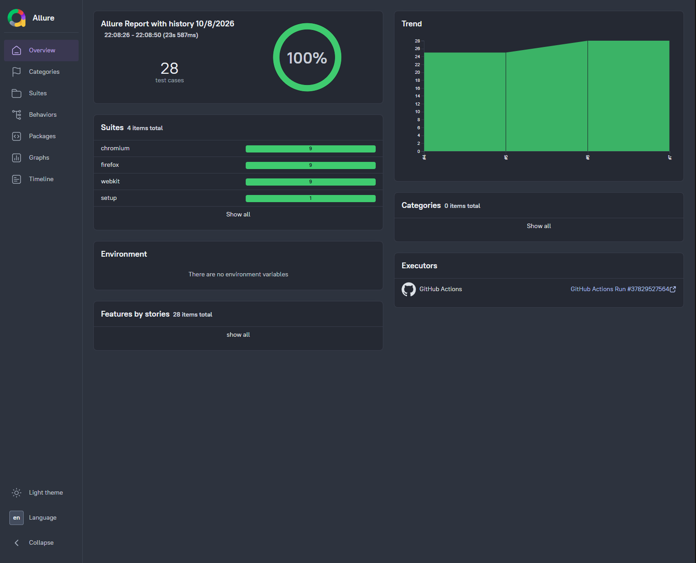

# SauceDemo — Playwright + TypeScript

[](https://github.com/kubradas/saucedemo-playwright-typescript/actions/workflows/ci.yml)

📊 **[Live test report](https://kubradas.github.io/saucedemo-playwright-typescript/)** — published from CI on every push

[](https://kubradas.github.io/saucedemo-playwright-typescript/)

---

End-to-end UI test suite for [saucedemo.com](https://www.saucedemo.com/), built with Playwright and TypeScript.

The application under test is deliberately simple. The engineering around it is not — this repo is about **how** a suite stays readable and cheap to maintain as it grows from 8 tests to 800.

## Tech stack

Playwright Test · TypeScript (strict) · Page Object Model · typed fixtures · `storageState` auth · Prettier · Chromium / Firefox / WebKit

## Project structure

```
├── fixtures/fixtures.ts     # typed custom fixtures (dependency injection)
├── pages/                   # Page Objects — locators + actions, no assertions
├── test-data/               # typed users, checkout factory, sort options
├── tests/                   # specs + auth.setup.ts
├── utils/assert-sorted.ts   # generic sorting assertion
└── playwright.config.ts
```

## Running

```bash
npm install
npx playwright install        # browser binaries (once, per machine)

npm test                      # all browsers
npm run test:chromium         # single browser, faster feedback
npm run test:ui               # interactive UI mode
npm run report                # open the last HTML report
npm run typecheck             # tsc --noEmit
npm run format                # prettier --write
```

## Architecture decisions

**Page Objects hold locators and actions — never assertions or test data.**
The same `CartPage` serves tests expecting 2 items, 3 items, or an empty cart. An expectation baked into the class welds it to one scenario. Page objects know _what the page is and what you can do with it_; tests know _what should be true_.

**Test data is typed, not stringly-typed.**
Usernames are a literal union rather than `string`, so `"standrd_user"` fails at compile time with a suggested fix — instead of surfacing as a confusing login error minutes into a browser run. Checkout data comes from a factory with `Partial<T>` overrides, so each test shows only the field it actually cares about.

**Fixtures replace constructors in tests.**
Page objects arrive ready-made and typed, so specs contain intent and nothing else — no `new`, no setup noise.

**Authentication happens once, not per test.**
A setup project logs in a single time and writes the session to disk; browser projects load it and start authenticated. The detail that's easy to get wrong: tests that _exercise_ authentication must opt out of it, or they silently stop proving anything.

**Retries differ by environment on purpose.**
Off locally, so a flaky test stays visible and gets fixed rather than masked green. On in CI, where a shared-runner hiccup shouldn't break the pipeline. Same setting, opposite intent: local is for diagnosis, CI is for resilience.

**The compiler does the nitpicking.**
`strict` plus `noUnusedLocals` means dead code fails the typecheck instead of surviving review; Prettier settles formatting so diffs carry only meaningful changes. Strictness is nearly free on day one and expensive to retrofit.

**One generic assertion instead of two near-identical ones.**
`assertSorted<T>` verifies both prices and names. Its array copy is load-bearing — `Array.sort()` mutates in place and returns the same reference, so sorting the original would compare it to itself and produce a test that can never fail. I confirmed it fails when it should by deliberately breaking it.

**CI runs cheap checks before expensive ones.**
`typecheck` and `format:check` take seconds and run before the suite, which spins up browsers and takes minutes — a broken type or an unformatted file fails immediately instead of waiting behind a full browser run. All three browsers run on every push, because a cross-browser claim that only ever runs in one browser is decoration.

**The report is published, not archived.**
Allure results uploaded as a CI artifact are technically available and practically invisible — nobody downloads a zip to look at a build. The report goes to GitHub Pages on every push with history carried over, so it's a link anyone can open, and flakiness surfaces as a trend across runs instead of a one-off red.

## Trade-offs

- **One `CheckoutPage` for a three-step flow.** A stricter reading of POM would split info / overview / confirmation. At this size that's ceremony; if the flow grew, splitting would be right.
- **No `test.describe` blocks.** Each spec file is already one logical group and Playwright reports the filename — nesting would add no information.
- **Hardcoded product IDs.** On a real app with changing catalogue data, this belongs behind API-seeded setup.

## What I'd add next

API-level setup for preconditions instead of driving the UI · visual regression coverage for the product grid

---

Built by **Kübra Daşdoğan** — QA Engineer
[GitHub](https://github.com/kubradas) · [LinkedIn](https://www.linkedin.com/in/kubradas/)
